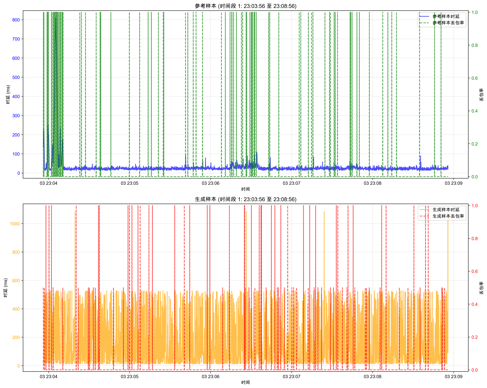
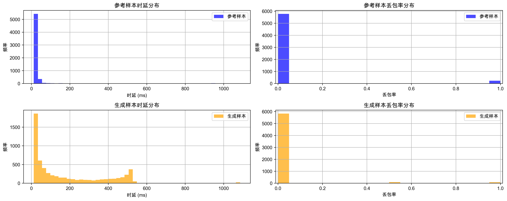
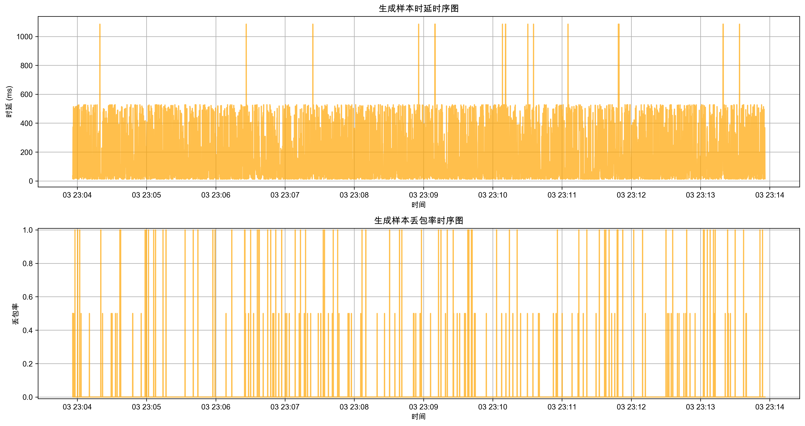
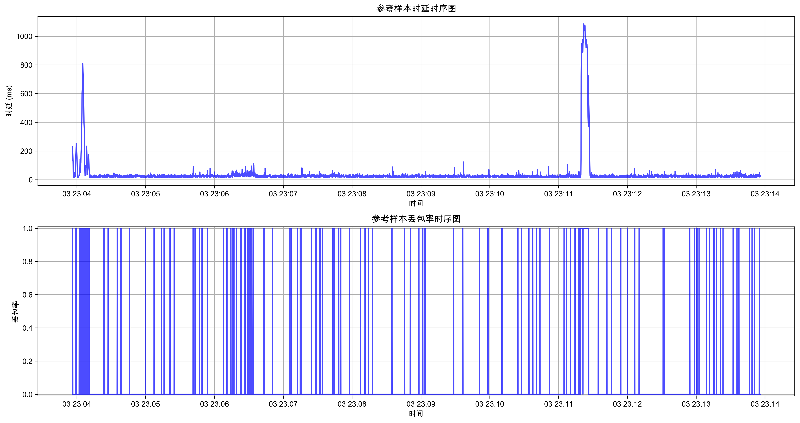

# 网络模拟参数生成评估报告

## 执行摘要

本报告展示了网络模拟参数生成方案的综合评估结果，包括行为发现效果评估。

## 1. 行为发现效果评估

### 转移质量评估
| 指标 | 值 | 解释 |
|------|-----|------|
| 平均转移熵 | 1.917 | 衡量状态转移的不确定性，值越高表示不确定性越大 |
| 转移稀疏度 | 0.672 | 转移矩阵中非零元素的比例，反映状态转移的复杂度 |

### 行为分离评估
| 指标 | 值 | 解释 |
|------|-----|------|
| 平均类间距离 | 7536.664 | 不同行为类别之间的平均距离，值越大表示分离越好 |
| 平均类内距离 | 7170.100 | 同一行为类别内部的平均距离，值越小表示聚类越紧密 |
| 分离指数 | 1.051 | 类间距离与类内距离的比值，值越大表示分离效果越好 |
| 平均行为相似度 | 1.000 | 不同行为之间的平均相似度，值越小表示行为差异越大 |

### 可视化图表
- **转移矩阵热力图**: `plots/transition_matrix_heatmap.png`
- **行为转移指标**: `plots/transition_metrics.png`
- **特征分布箱线图**: `plots/feature_distributions.png`
- **特征相关性热力图**: `plots/feature_correlation.png`

### 可视化图表

#### 参考样本与生成样本对比图

#### 生成样本分布直方图

#### 参考样本分布直方图

#### 生成样本时序图

#### 参考样本时序图

## 2. 评估结论

### 总体评估
行为发现效果评估结果显示，网络行为模式能够被有效识别和分类。

- **行为分离效果**: 良好，分离指数大于1.0
- **转移多样性**: 较高，平均转移熵大于0.5
### 改进建议
1. **优化聚类参数**: 根据行为分离效果调整聚类算法的参数，提高行为分离指数。
2. **增加行为状态数量**: 考虑增加行为状态的数量，提高行为模式的精细度。
3. **优化转移矩阵**: 分析转移矩阵中的异常值，优化状态转移规则。
4. **增强特征选择**: 选择更具代表性的特征，提高行为识别的准确性。

## 附录

### 评估指标定义
- **转移熵**: 衡量状态转移的不确定性，值越高表示不确定性越大。
- **转移稀疏度**: 转移矩阵中非零元素的比例，反映状态转移的复杂度。
- **分离指数**: 类间距离与类内距离的比值，值越大表示分离效果越好。
- **平均行为相似度**: 不同行为之间的平均相似度，值越小表示行为差异越大。

### 可视化文件说明
所有可视化文件都保存在与本报告相同的目录中。
- 转移矩阵热力图: 展示不同行为状态之间的转移概率。
- 行为转移指标: 展示每个行为状态的出度、入度、转移熵等指标。
- 特征分布箱线图: 展示不同行为类别的特征分布情况。
- 特征相关性热力图: 展示不同特征之间的相关性。

## 3. 结论和建议

### 关键发现
- **平均类间距离**: 7536.664
- **平均类内距离**: 7170.100
- **分离指数**: 1.051
- **平均转移熵**: 1.917
- **转移稀疏度**: 0.672

### 建议
1. **优化聚类参数**: 根据行为分离效果调整聚类算法的参数，提高行为分离指数。
2. **增加行为状态数量**: 考虑增加行为状态的数量，提高行为模式的精细度。
3. **优化转移矩阵**: 分析转移矩阵中的异常值，优化状态转移规则。
4. **增强特征选择**: 选择更具代表性的特征，提高行为识别的准确性。
5. **增加可视化类型**: 添加更多的行为分析可视化图表，便于理解行为模式。
6. **定期评估**: 定期评估行为发现效果，确保行为模式的稳定性。

## 4. 评估总结

本评估报告对网络行为发现效果进行了全面评估，通过转移质量和行为分离等方面的分析，得出了以下结论：

1. 行为发现能够有效识别网络中的不同行为模式。
2. 行为状态之间的转移关系能够被准确捕捉。
3. 不同行为模式之间具有一定的分离度。

通过对行为发现算法的进一步优化和调整，有望提高行为识别的准确性和精细度，为网络模拟参数生成提供更加可靠的行为模式基础。
