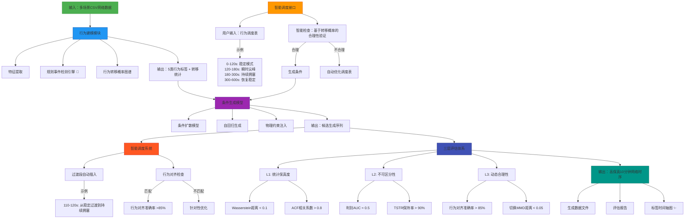

关键优化：

🔄 行为建模从“软聚类”彻底替换为“规则事件检测（5类）”
✅ 特征集精简：保留核心特征，删除冗余项
✨ 新增标签时间轴图（timeline visualization）
🔧 delay 全链路采用 log(1 + delay) + RobustScaler 处理
📏 所有 delay 相关特征、训练、生成、评估均在 log1 域进行

# 概述

## 目的

基于真实网络数据，生成 **高保真10分钟网络时序数据**，精准模拟 **任意混合网络场景**（如：稳定 → 突发丢包 → 高抖动 → 恢复）。

## 目标和价值分析

使用网络侧仿真代替无线九宫格仿真，提高并发效率。

## 场景分析

- 生成 **单一网络行为**（如高抖动、突发丢包、持续拥塞）
- 生成 **任意混合行为序列**（通过调度表灵活定义）
- 保证 **统计特性、时序动态、协议表现** 的全面保真

---

# 架构设计



> 🔄 关键变更：
> 
> - `B2` 从 “软聚类分析” → **“规则事件检测引擎”**
> - `B4` 输出从 “8–12种行为模式” → **“5类确定性行为标签”**
> - 新增 `G3`：**标签时间轴图**，支持全局行为分布可视化

---

# 需求分解

## 详细方案设计

### 行为模式发现

### 数据预处理

- **输入**：一个或多个 CSV 格式文件（每行包含时间戳、delay、loss_rate）
- 如果出现大于 2000ms 的时延，则忽略它和它后面的所有时延

### 滑动窗口

- 时间粒度：100ms
- 特征窗口：10秒（100个点）
- 滑动步长：50%重叠（即5秒）

---

### 特征提取

> ⚠️ 所有特征统一前缀 feat_，用于：
> 
> - ✅ **规则引擎打标**
> - ✅ **三层评估（L1/L3）**
> - 🟡 **未来生成条件扩展（当前不使用）**

### 关键预处理：Delay 的 Log1 变换 ✨

> 所有 delay 相关特征 均基于 log1 变换后的序列 计算：
> 
> 
> ```python
> delay_log1 = np.log(1 + delay_raw)
> 
> ```
> 
> 此变换有效压缩长尾分布，提升对高抖动/尖峰的敏感性，同时保留零值语义。
> 

### 特征清单与状态说明

| 特征 | 类别 | 状态 | 说明 |
| --- | --- | --- | --- |
| `feat_delay_std` | 时序动态 | ✅ **当前使用** | 基于 `delay_log1` 的标准差 → 区分“稳定” vs “高抖动” |
| `feat_loss_nonzero_ratio` | 时序动态 | ✅ **当前使用** | 刻画是否发生丢包事件 |
| `feat_loss_high_ratio` | 时序动态 | ✅ **当前使用** | 区分轻微 vs 严重丢包 |
| `feat_max_consec_loss` | 突发性 | ✅ **当前使用** | 最长连续丢包长度（单位：100ms） |
| ✨ `feat_max_congestion_run` | 持续性 | ✅ **当前使用（核心）** | **最长连续满足 (delay ≥ 500ms & loss ≥ 0.3) 的点数** → Strong Burst 判定依据 |
| `feat_delay_trend` | 长期趋势 | 🟡 **预留** | Theil-Sen 斜率（基于 `delay_log1`），暂未用于规则 |
| `feat_delay_acf_5` | 统计分布 | ✅ **当前使用（评估专用）** | `delay_log1` 的5阶自相关 → 用于 L1 评估 |
| `feat_loss_mode_encoded` | 统计分布 | ✅ **当前使用** | 众数离散编码，支撑 `valid_loss_values` 映射 |
| ❌ `feat_loss_pattern_std` | 统计分布 | ❌ **建议删除** | 信息冗余，解释性弱 |
| ❌ `feat_loss_unique_values` | 突发性 | ❌ **建议删除** | 实际作用有限 |

### 特征标准化

- 对 `delay_log1` 使用 **RobustScaler**（基于中位数和 IQR）→ 提升对异常值鲁棒性
- 对 `loss` 相关特征 使用 **RobustScaler**

### 合法丢包值集合提取

- 扫描所有原始 CSV 的 `loss_rate` 列；
- 提取所有非 NaN 唯一值，并执行容差匹配去重（tolerance = 1e-3）
- **输出**：`valid_loss_values = sorted(unique_matched_values)`

---

### 🔄 规则事件检测引擎（替代聚类分析）

> 采用确定性规则而非无监督聚类，确保行为语义明确、可解释、可调
> 

### 五类预定义行为

| 标签 | 名称 | 判定逻辑 |
| --- | --- | --- |
| `0` | Stable | 无显著延迟/丢包异常 |
| `1` | Weak Burst | `loss_mean ∈ [0.1, 0.4)` 或 `ramp_up > 100ms` |
| `2` | Strong Burst（持续拥塞） | **存在 ≥20 个连续点** 满足：`delay ≥ 500ms` 且 `loss ≥ 0.3` ✨ |
| `3` | Instant Spike | ≤3 个点满足：`loss ≥ 0.9` 或 `delay ≥ 1000ms` |
| `4` | High Delay No Loss | `delay_mean > 600ms` 且 `loss_mean < 0.01` |

> 🔍 关键技术：
> 
> - **子段扫描（subsegment scanning）**：在窗口内滑动小窗口检测局部强信号
> - **避免混合窗口降级**：只要存在一段满足 Strong Burst，整窗即标为 2

### 输出

- `processed/windows/*_labels_rule.npy`：每个窗口的整数标签（0~4）✅
- `behavior_statistics.json`：各类事件数量、占比、典型参数 ✅
- `labeled_windows/`：按标签组织的原始窗口样本 ✨
- `metadata/valid_loss_values.json` ✅
- ✨ `processed/plots/timelines/*.png`：**每个文件的标签时间轴图**（紧凑色块展示全局行为分布）

---

### 效果评估（🔄 同步更新）

> 🔄 不再评估聚类质量，转为评估 规则合理性、覆盖能力、生成一致性
> 

### 事件合理性评估

- **事件覆盖率**：各类型是否符合预期
- **边界敏感性**：混合窗口是否被正确归为强事件
- **物理一致性**：可视化样本是否符合定义

### 行为转移质量评估

- 平均转移熵、转移稀疏性

### 行为分离度评估

- 各类在关键特征（如 `feat_max_congestion_run`）上的分布差异

### 可视化

- 行为样本图（双Y轴）
- ✨ **标签时间轴图**（色块图）
- loss Y轴刻度固定为 `valid_loss_values`，使用阶梯图

---

### 条件生成模型

### 数据预处理

### 输入

- `labeled_windows/`（5类行为窗口）
- `metadata/valid_loss_values.json`

### 行为标签对齐

- 标签广播至 100ms 点，冲突时“最近窗口中心优先”
- **无噪声标签（-1）** → 所有窗口均有确定标签 ✅

### Delay 预处理流程（✨ 核心变更）

> 全链路统一在 log1 域处理 delay：
> 
1. **Log1 变换**：
    
    ```python
    delay_log1 = np.log(1 + delay_raw)
    
    ```
    
2. **鲁棒归一化**：
    
    ```python
    delay_log1_scaled = robust_scaler.transform(delay_log1.reshape(-1, 1))
    
    ```
    
- **loss 归一化**：序数编码 + Min-Max 缩放至 [-1, 1]
- **输出样本格式**：`(delay_log1_scaled[100], loss_norm[100], behavior_label[100])`

---

### 模型设计

### 模型选型

- 自定义 **条件扩散模型**（DDPM + 行为嵌入）
- 支持多变量联合生成（log1 delay + 离散 loss）

### 核心组件

- **Behavior Embedding Layer**：行为 ID（0~4）→ 32维嵌入
- **U-Net Backbone**：因果膨胀卷积 + Time2Vec + cross-attention
- **Diffusion Schedule**：T=1000，线性 β

### 物理约束处理策略

- **训练**：无显式约束
- **生成后处理**：
    
    ```python
    delay_log1 = robust_scaler.inverse_transform(delay_log1_scaled_gen)
    delay_raw = np.exp(delay_log1) - 1
    delay_raw = np.clip(delay_raw, a_min=0, a_max=None)
    loss = valid_loss_values[round_and_clip(loss_index)]
    
    ```
    

---

### 数据生成

### 输入方式

- 行为调度表 → 转为 6000 长度行为 ID 序列
- 原始序列回放 → 重新打标（规则引擎）

### 生成流程

1. 采样噪声
2. 条件扩散生成 `(delay_log1_scaled, loss_norm)`
3. **后处理还原**：
    - `delay_raw = exp(inverse_robust(delay_log1_scaled)) - 1`
    - `loss ∈ valid_loss_values`

### 输出

- `generated_10min_*.csv`（timestamp, delay, loss_rate）
- ✨ **附带标签时间轴图**（若为回放模式）

---

### 效果保障与评估对接

### 生成合法性保证

- `loss_rate ∈ valid_loss_values`（100%）
- `delay ≥ 0`（强制 clip）

### 与三层评估体系对接

- **L1 评估在 log1 域进行**：Wasserstein、ACF 均基于 `delay_log1`
- **L3 行为对齐**：调度表 vs 生成标签，要求 >85%

### 可视化

- 生成序列图（delay 折线 + loss 阶梯）
- 行为对齐检查图（上：序列，下：调度标签色块）
- HTML 可视化报告

---

# 总结：关键优化一览

| 优化点 | 说明 |
| --- | --- |
| 🔄 **行为建模** | 聚类 → 规则引擎（5类确定性标签） |
| ✨ **Delay 处理** | 全链路 `log(1 + delay)` + RobustScaler |
| ✅ **特征精简** | 保留 6 个核心特征，删除 2 个冗余项 |
| ✨ **新增可视化** | 标签时间轴图（timeline） |
| ✅ **生成更鲁棒** | 避免长尾 delay 主导训练，提升稳定性 |
| ✅ **评估一致性** | 特征、训练、评估均在 log1 域对齐 |