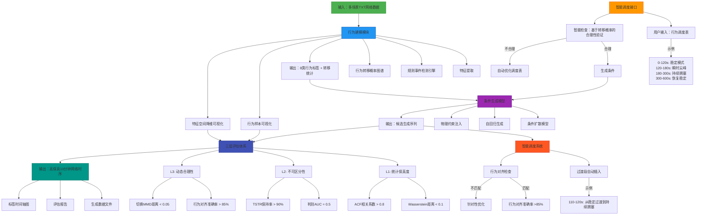

# 网络模拟系统方案1.4

## 概述

### 目的

基于真实网络数据，生成 **高保真10分钟网络时序数据**，精准模拟 **任意混合网络场景**（如：稳定 → 突发丢包 → 高抖动 → 恢复）。

### 目标和价值分析

- 使用网络侧仿真代替无线九宫格仿真，**提升并发效率与场景覆盖能力**
- 支持 **协议栈测试、QoE 评估、AI 训练数据增强** 等下游任务

### 场景分析

- 生成 **单一网络行为**（如高抖动、突发丢包、持续拥塞）
- 生成 **任意混合行为序列**（通过调度表灵活定义）
- 保证 **统计特性、时序动态、协议表现** 的全面保真

---

## 架构设计



---

## 需求分解

### 详细方案设计

### 行为模式发现

### 数据预处理

- **输入**：TXT 文件（timestamp, delay1, loss_rate1, bandwidth1, delay2, loss_rate2, bandwidth2）
- **异常截断**：若 delay > 2000ms，忽略该点及之后所有数据

### 滑动窗口

- 时间粒度：100ms
- 窗口长度：10秒（100点）
- 滑动步长：5秒（50%重叠）

### 特征提取

> 所有特征以 feat_ 开头。delay 相关特征基于 log1 变换序列计算：
> 
> ```python
> delay_log1 = np.log(1 + delay_raw)
> 
> ```

| 特征 | 类别 | 状态 | 说明 |
| --- | --- | --- | --- |
| `feat_delay_std` | 时序动态 | ✅ | `delay_log1` 的标准差 → 区分稳定 vs 抖动 |
| `feat_loss_nonzero_ratio` | 时序动态 | ✅ | loss > 0 的比例 → 是否发生丢包 |
| `feat_loss_high_ratio` | 时序动态 | ✅ | loss ≥ 0.5 的比例 → 轻微 vs 严重丢包 |
| `feat_max_consec_loss` | 突发性 | ✅ | 最长连续丢包长度（100ms 单位） |
| `feat_max_congestion_run` | 持续性 | ✅ | 最长连续满足 (delay ≥ 500ms & loss ≥ 0.3) 的点数 → Strong Burst 核心依据 |
| `feat_delay_acf_5` | 统计分布 | ✅ | `delay_log1` 的5阶自相关 → 用于 L1 评估 |
| `feat_loss_mode_encoded` | 统计分布 | ✅ | loss 众数的序数编码 → 支撑离散值还原 |
| `feat_delay_trend` | 长期趋势 | ✅ | Theil-Sen 斜率 |
| `feat_loss_unique_values` | 统计分布 | ✅ | loss 唯一值数量 |
| `feat_loss_pattern_std` | 统计分布 | ✅ | loss 模式标准差 |

### 特征标准化

- `delay_log1` → **RobustScaler**（median + IQR）
- `loss` 特征 → **RobustScaler**

### 合法丢包值集合

- 提取全量 `loss_rate` 唯一值（容差 1e-3 去重）
- 输出：上下行独立的 `valid_loss_values`

---

### 规则事件检测引擎（8类行为）

| 标签 | 名称 | 判定逻辑 |
| --- | --- | --- |
| `0` | STABLE | 无显著异常 |
| `1` | WEAK_BURST | 弱突发，影响较轻 |
| `2` | STRONG_BURST | 强突发，较大影响 |
| `3` | INSTANT_SPIKE | 瞬时峰值，影响最严重 |
| `4` | HIGH_DELAY_NO_LOSS | 高延迟无丢包，中等影响 |
| `5` | HIGH_LOSS_STEADY | 持续高丢包，较大影响 |
| `6` | FREQUENT_FLUCTUATION | 频繁波动，中等影响 |
| `7` | LOW_DELAY_HIGH_LOSS | 低延迟高丢包，严重影响 |
| `-1` | INVALID | 无效窗口 |

### 输出

- `labeled_windows/`：按行为组织的 10 秒窗口 CSV
- `_labels_rule.npy`：窗口级标签
- `behavior_statistics.json`：事件统计
- `metadata/valid_loss_values.json`
- ✨ **`plots/behavior_samples/class_{k}_sample_{i}.png`**
- ✨ **`plots/timelines/{file}_timeline.png`**
- ✨ **`plots/feature_space/tsne.png`, `umap.png`**

---

### 效果评估

### 可视化体系

1. **行为样本图**
    - 每类 1~3 个窗口
    - 左Y轴：**原始 delay（ms）折线图**
    - 右Y轴：**loss_rate 阶梯图**，刻度 = `valid_loss_values`
    - 用途：人工验证规则合理性
    - 支持：上下行数据独立可视化
2. **标签时间轴图**
    - 全局行为分布色块图
    - 快速定位异常行为链
    - 包含原始的时延、丢包率便于对比
    - 支持：完整文件时间轴，避免行为块被切割
3. **特征空间降维图（t-SNE / UMAP / PCA）**
    - 输入：10维特征向量
    - 着色：按行为标签（0~7）
    - 理想：8类清晰分离
    - 支持：上下行数据独立可视化

### 行为转移评估

- 转移熵、稀疏性、典型路径分析

---

### 条件生成模型

### 数据预处理

- **Delay 处理链路**：
    
    ```
    raw delay
      → log(1 + delay)
      → RobustScaler
      → diffusion input
    
    ```
    
- **生成后还原**：
    
    ```
    diffusion output
      → inverse RobustScaler
      → exp(x) - 1
      → clip(delay, 0)
    
    ```
    
- **Loss 处理**：序数编码 → MinMax → 生成后映射回 `valid_loss_values`

### 模型设计

- **条件扩散模型（DDPM）**
- **Behavior Embedding**：8类标签 → 32维嵌入
- **U-Net Backbone**：因果膨胀卷积 + Time2Vec + cross-attention
- **T=1000 步，线性 β 调度**
- **输入维度**：明确指定 cond_dim 参数，避免动态层创建

### 生成流程

1. 用户输入调度表 → 转为 6000 长度行为 ID 序列
2. 扩散模型生成 `(delay_log1_scaled, loss_norm)`
3. 后处理还原为物理合法序列
4. 智能调度系统插入过渡段，确保平滑切换

---

### 效果保障与评估对接

| 评估层 | 指标 | 说明 |
| --- | --- | --- |
| **L1: 统计保真度** | Wasserstein < 0.1ACF > 0.8loss KL < 0.1 | 均在 **log1 域** 计算 |
| **L2: 不可区分性** | 判别 AUC ≈ 0.5TSTR > 90% | 生成 vs 真实不可分 |
| **L3: 动态合理性** | 行为对齐 > 85%切换 MMD < 0.05 | 调度表 vs 生成标签一致 |

> ✅ **硬性约束**：
> 
> - `loss_rate ∈ valid_loss_values`（100%）
> - `delay ≥ 0`

---

## 总结：核心优势

| 维度 | 优势 |
| --- | --- |
| **可控性** | 8类语义行为 + 调度表 → 精准控制任意混合场景 |
| **保真度** | log1 + 物理约束 + 三层评估 → 高保真时序 |
| **可解释性** | 规则打标 + 样本图 + 降维图 → 透明可调试 |
| **鲁棒性** | 无聚类失败、无噪声标签、特征精简 |
| **扩展性** | 支持未来“标签+关键特征”双条件生成 |
| **上下行分离** | 支持上下行数据独立处理和生成 |

---

> 📌 **交付物清单**
> 
> - 生成数据：`generated_10min_*.csv`
> - 评估报告：HTML 格式（含所有可视化图）
> - 元数据：`valid_loss_values.json`, `behavior_statistics.json`
> - 可视化资产：`behavior_samples/`, `timelines/`, `feature_space/`